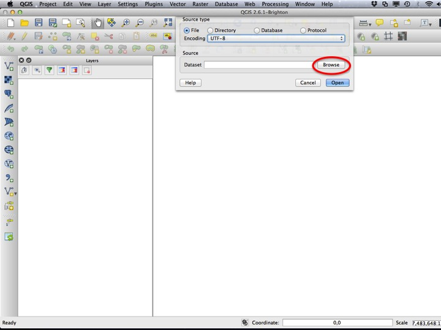
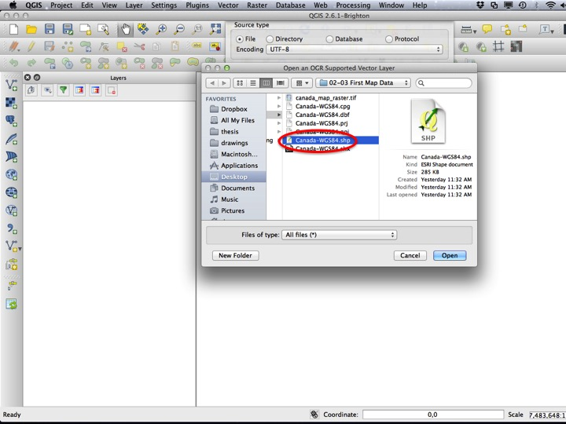
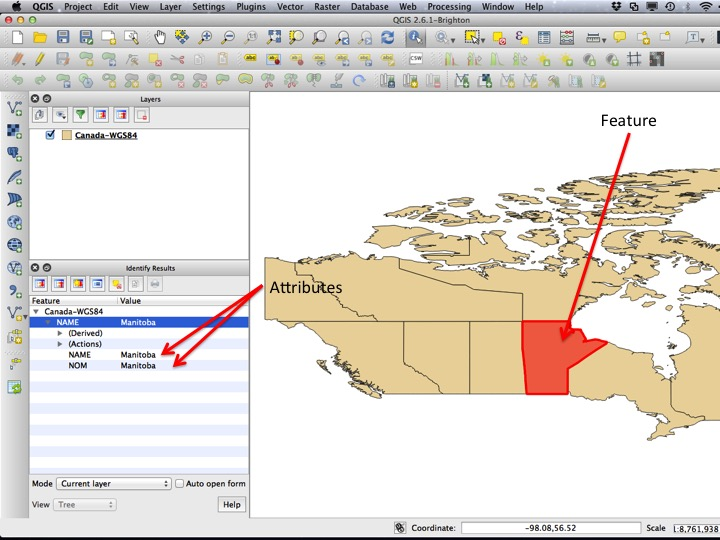
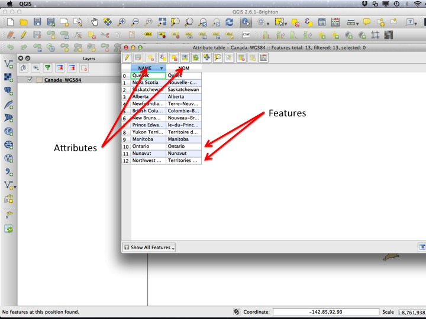
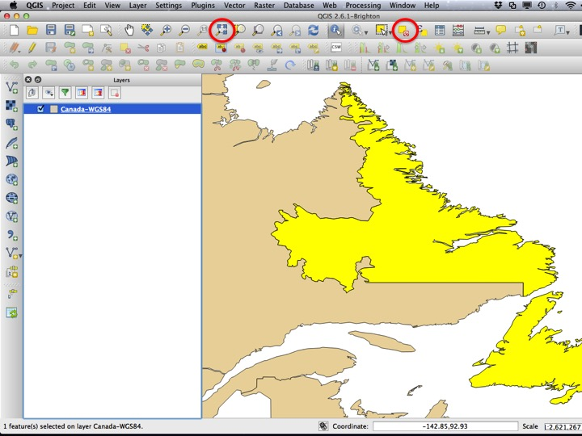
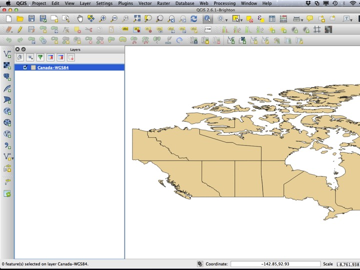
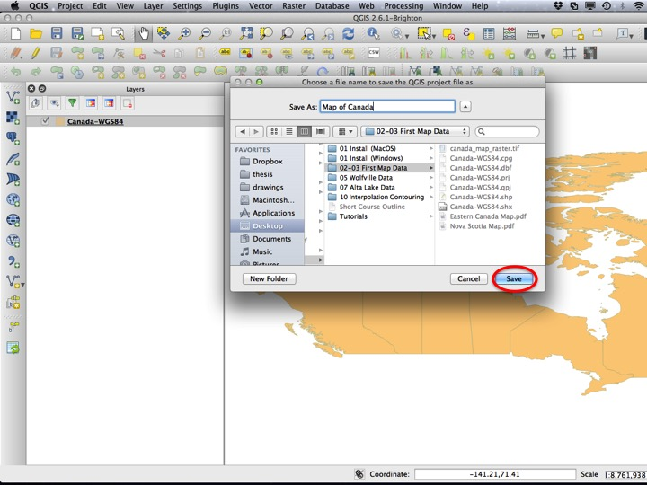

Go back to the [course outline](00_Course_outline.html)

## Purpose

* Learn several ways to add data to a QGIS project
* Learn how to pan, zoom, and identify the attributes of various features
* Learn how to save a QGIS project file

## Assignment

There is no assignment for this tutorial.

## Tutorial

### Adding Data

Add a "vector layer".

Browse for a file.

Choose "Canada-WGS84.shp" from the "02-03 First Map Data" folder within the tutorial data directory.

Remove the layer.

Another way to add a layer is to drag and drop from the file manager. Drag the "Canada-WGS84.shp" from the "02-03 First Map Data" folder into the "Layers" panel (you will always drag the ".shp" file when adding vector layers in this way).

### Basic Map Tools

Useful tools for getting around the map are the "pan" tool (the hand), the "zoom" tools, and the "identify" tool. 

Choose the "identify" tool.

Click on one of the "features" on the map. A list of "attributes" should appear in the QGIS window.

Attribute values can also be accessed through the **attribute table**. Right click on the layer in the *Layers* window, and choose *Open Attribute Table*.

In the **attribute table**, **features** are in rows, and **attributes** are in columns.

Click on one of the features to **select** that feature. Next, click on the *Zoom Selected* icon to zoom the map to show that **feature**.

To unselect the feature and return the map to its original position, chose *Deselect Features from All Layers* and then *Zoom Full*.

The map should be zoomed out to all of Canada.

### QGIS Projects

QGIS *Projects* save the state of the map, references to the data that are on your map, and the styles you've defined for your layers. *Saving a project will not save your data*. For this reason, it's usually a good idea to keep your QGIS project file and your spatial data in the same folder. 

To save the map of canada project, choose *Save As* from the *Project* menu.

Enter a file to which the project should be saved (save it within the "02-03 First Map Data folder").

Were you to open the project file again, the map should appear exactly as you left it, provided that you didn't move any of the spatial data relative to the project file.

### Sequel

Keep this map open, you'll be using it in the next section, [Coordinate Reference Systems](03_Map_of_Canada_CRS.html).
