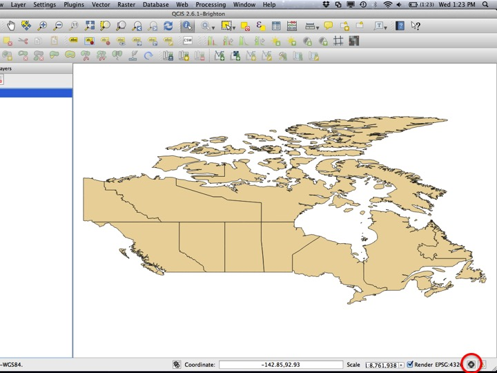
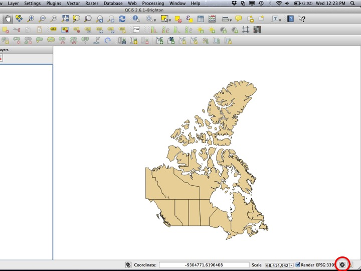
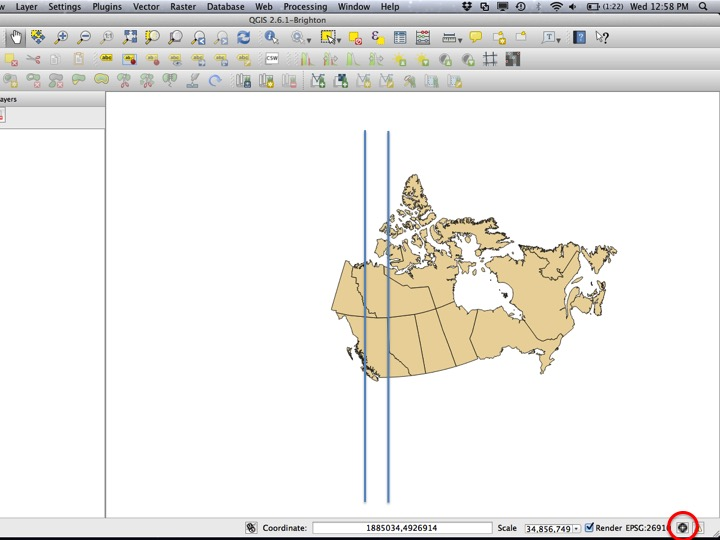
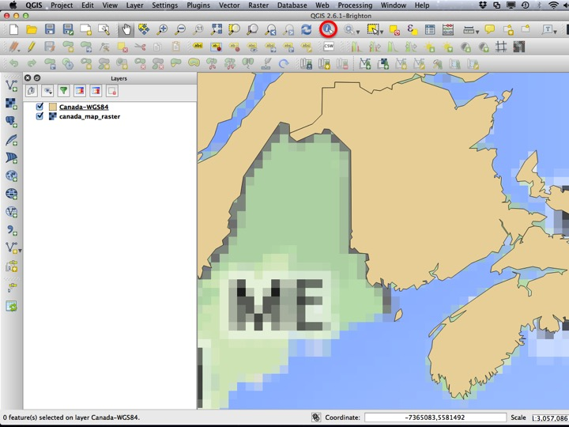

Go back to the [course outline](00_Course_outline.html) or the [Map of Canada](02_Map_of_Canada.html) tutorial.

## Purpose

* Demonstrate the difference between different **projections** and how to switch between them in QGIS.
* Demonstrate how to change the **visibility** and order of **layers**.
* Illustrate the difference between **vector** and **raster** layers.

## Assignment

There is no assignment for this module.

## Tutorial

### Changing the Project CRS

This tutorial starts at the end of the [Map of Canada](02_Map_of_Canada.html) tutorial. If you don't already have this window open, you can add the "Canada-WGS84.shp" layer from the "02-03 First Map Data" folder within the tutorial data directory.

To examine or change the **Project CRS**, click the globe-looking thing in the lower right corner of the QGIS window.

This will open a window enabling you to choose another CRS. A commonly used CRS is the "World Mercator" projection. To find it, type "mercator" into the *Filter* text box, and select "Word Mercator" from the list of CRSs. Select *OK* to apply the change.

The shape of your map should now appear different. To change the *Project CRS* again, click the globe in the lower right corner of the QGIS window.

The Mercator projection exaggerates areas in the far north, and is usually not appropriate for a nationwide map of Canada. There are several Canadian-specific projections, one of which is the "Canada Albers Equal-Area Conic". This projection provides a reasonable representation of all of Canada.

Your map should now appear like this. To change the *Project CRS* yet again, click the globe in the lower right corner of the QGIS window.

Smaller-scale maps often use the **Universal Transverse Mercator** projection, which approximates small areas well. Nova Scotia is often represented by UTM Zone 20. Choose the "WGS 85 / UTM zone 20N" from the CRS list.

Notice how the meridian surrounding Nova Scotia is represented well by the projection, but other areas are not. To illustrate the effect of chaging the UTM Zone, we will change the Project CRS again.

British Columbia is often represented in UTM Zone 10N. Choose this CRS from the CRS list.

UTM Zone 10 represents British Columbia well, but other areas are distorted. Finally, we will change the CRS one last time.

For the rest of the tutorial, we will use the "World Mercator" projection. You can choose this from your recently used CRS list or by typing "mercator" into the *Filter* text box.

Your map should now look like this.

### Raster Layers

So far we have only worked with one **layer** that is a **vector** layer. To add a **raster** layer, choose *Add Raster Layer* from the toolbar on the left (or the *Layers* menu), and select "canada_map_raster.tif" from the "02-03 First Map Data" folder.

When more than one **layer** is in a project, they can be ordered such that one is drawn before the other. Drag the "canada_map_raster" layer below the other layer to change the draw order.

You can also toggle the visibility of a layer. To toggle the visibility, click the check mark beside the layer name.

To toggle the visibility back on, click the box again.

### Identify with Raster Layers

So far, we have only used the *Identify* tool with vector layers. The tool also works with raster layers.

Use the zoom tool to zoom in to Nova Scotia (we are zooming in so that you can see that a raster dataset is a "grid" of values). Choose the *Identify* tool.

When the *Identify* tool is selected and there is more than one layer, you need to tell QGIS which layer to *Identify* from by selecting it in the *Layers* panel. Then, click somewhere on the map. The values that appear ("Band 1", "Band 2", and "Band 3") are the values contained for that cell in the raster. In this case, the values are red, green, and blue values. In other cases, this value will be an elevation, or other continuous parameter.

## Sequel

We will use this map for the next module, on [using the print composer](04_The_Print_Composer.html)

