Go back to the [course outline](00_Course_outline.html) or the [Map of Canada CRS](03_Map_of_Canada_CRS.html) tutorial.

## Purpose

* Learn how to use a *Print Composer* to export your map to an image or PDF.
* Learn how to manage multiple composers.

## Assignment 

The assignment for this module is a PDF map of Nova Scotia with a scale bar and north arrow. When complete, it should look like the image below.

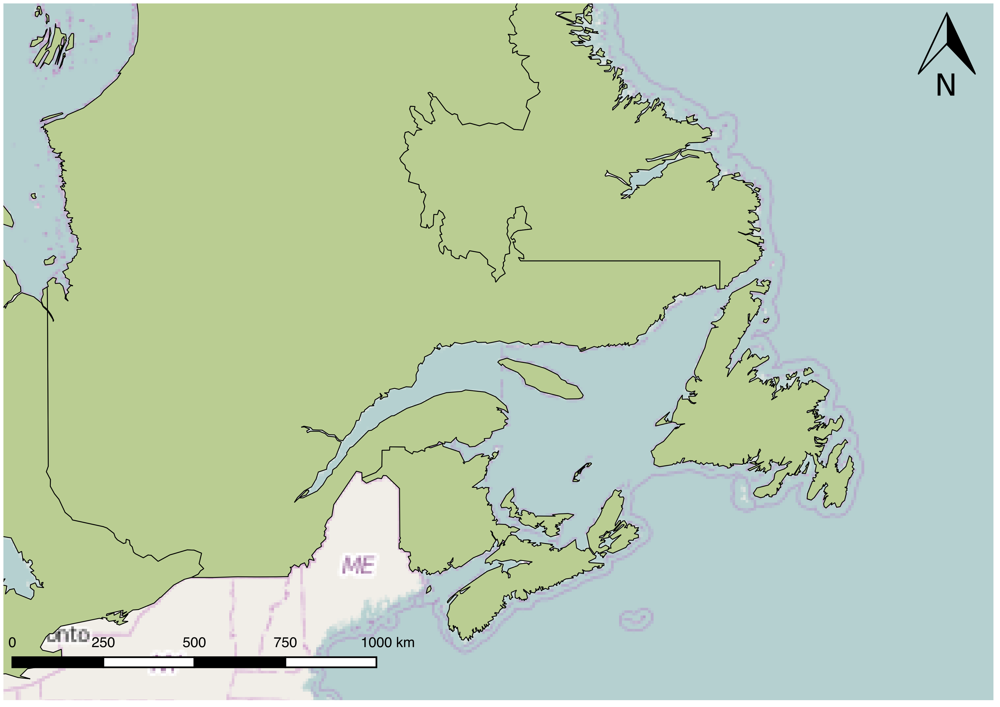

## Tutorial

### Creating a Print Composer

Choose the *Zoom* tool and zoom in to Nova Scotia.

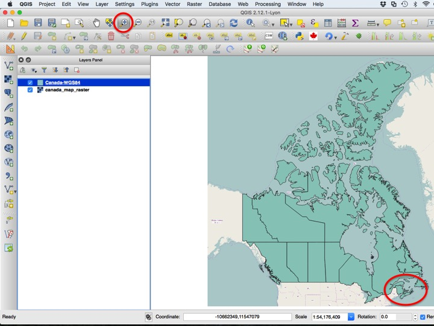

Next, choose *New Print Composer* from the *Project* menu.

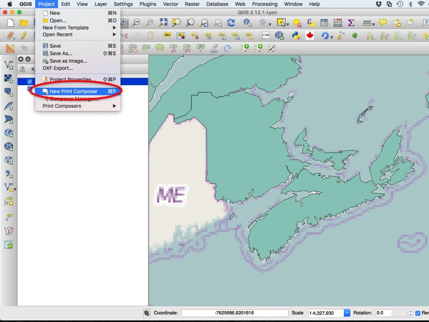

For now, leave the name of the Print Composer blank, and hit OK to create the Print Composer.

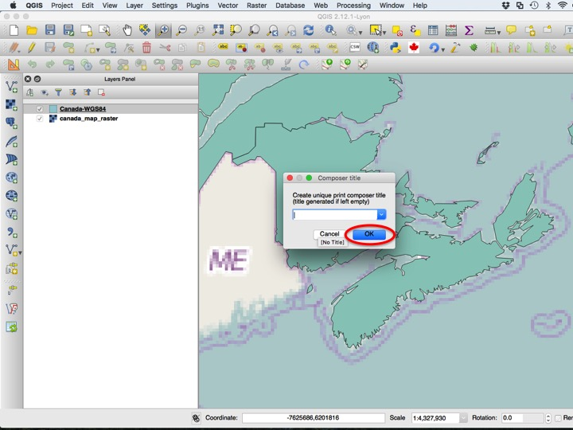

The Print Composer window resembles that of basic vector drawing software. You will (almost) always add a map, scale bar, and north arrow to your maps (and you should always add them in that order!). To add a map, choose the *Add Map* icon on the left side of the window.

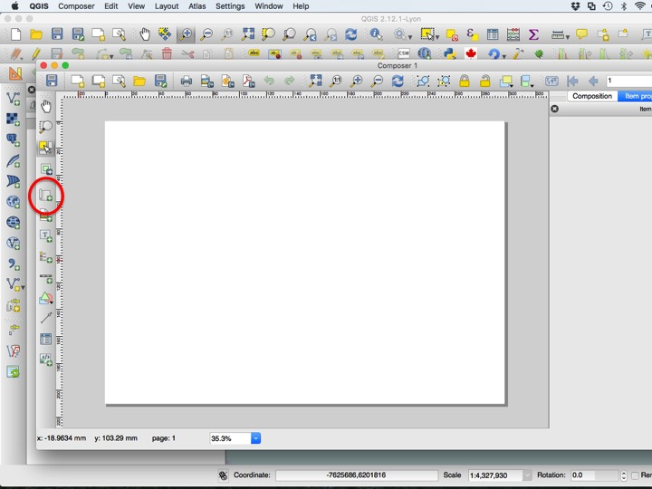

Next, drag from corner to corner where the map should be located.

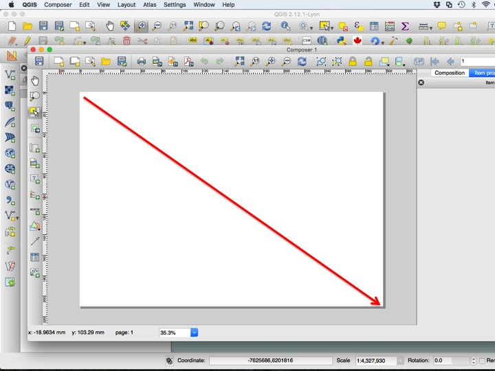

The next step is to add a scale bar. Choose the *Add Scale Bar* tool from the left side of the window, and click somewhere on the page.

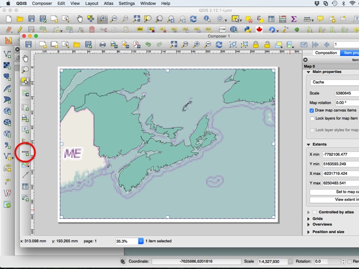

A scale bar synced with the map should now appear. Drag it to where you want it on the page.

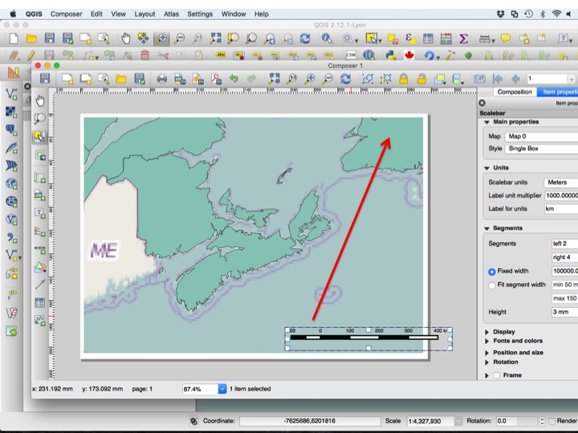

Each element on the page has *properties* associated with it. By default, scale bars two "left" segments, which I think look ugly. Change this to zero left segments to remove them.

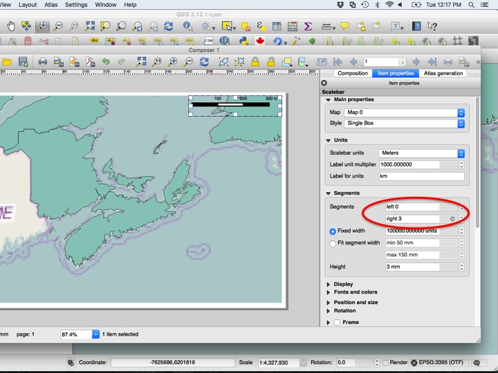

To add a North Arrow, choose the *Add Image* tool from the left side of the window. Next, drag from corner to corner to approximately where you would like the north arrow on the page.

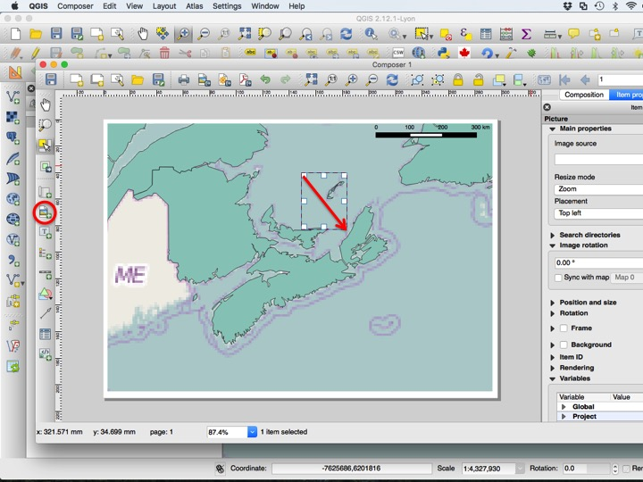

In the *Item properties*, choose the *...* button to set the image source.

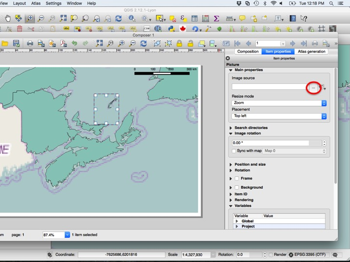

There is a vector drawing of a north arrow included in the tutorial data folder. Choose the north arrow of your choice.

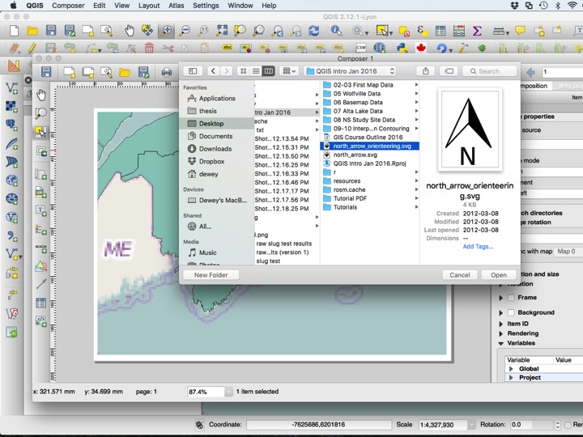

To synchronize the north arrow with the map, check the *Sync with map* check box.

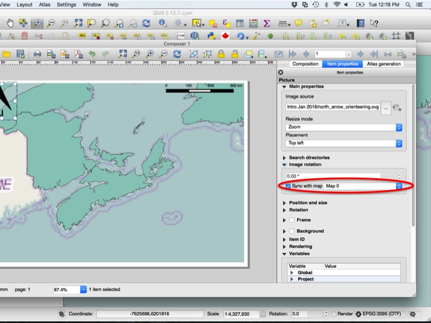

To export the map, choose on of the three export formats provided by QGIS. For now, we will not export the map. Close the composer window to return to your QGIS project.

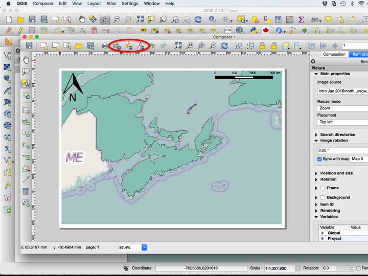

You can return to the composer at any time by choosing your composer from the *Print Composers* submenu of the *Project* menu. Composers are saved within projects, so when you hit *Save* on your print composer, you will save the project, and when you choose *Save* from within your project, you will save all of the print composers you have created.

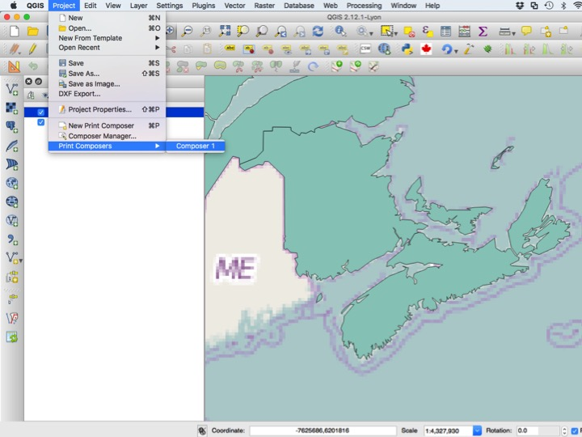

### Multiple Print Composers

It is often desirable to have multiple print composers from a single project. I usually do this when I have the same map that I need for different page sizes (e.g. one for a powerpoint and one for a thesis diagram and one for a publication, etc.), or when I need the same page size with multiple extents when the layers look the same for each map. This significantly reduces the amount of duplication in the map-making workflow.

To make a new composer, choose *New Print Composer* from the *Project* menu.

Choose the *Add Map* tool and drag where you want the map on the page.

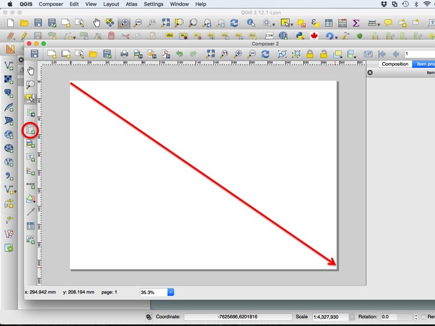

By default, the map will show whatever area is shown in the project window when you create the composer. Often, this is not the desired extent. To move the extent shown in the map, choose the *Move item content* tool from the left side of the window. To zoom in or out, you can use your mouse scroll wheel or change the scale in the *Item properties* panel.

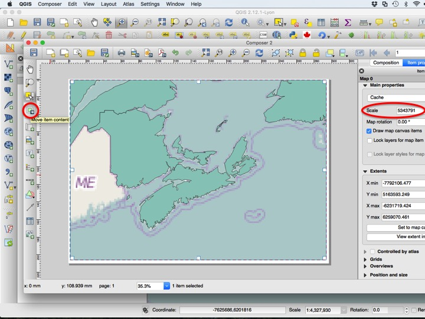

Change the extent to show all of atlantic canada. You will always want to set your map size and extent before adding a scale bar.

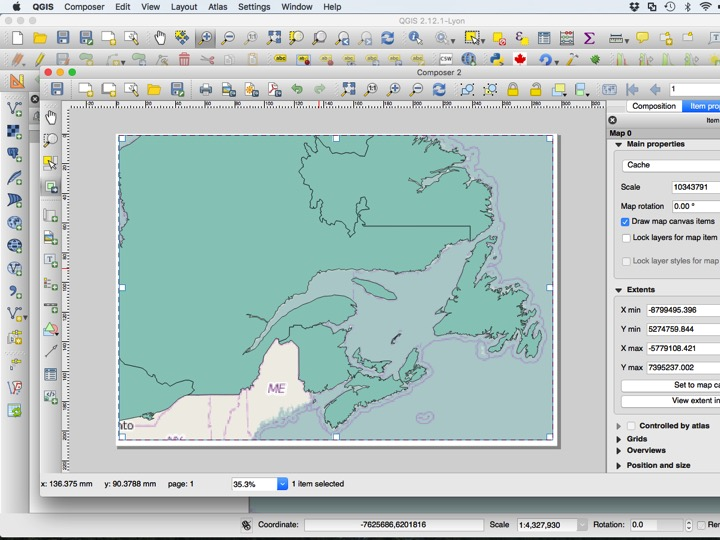

Next, add a scale bar.

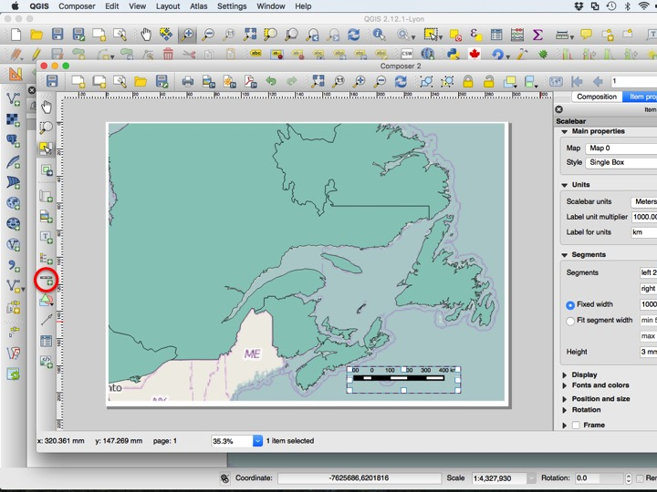

Move and configure the scale bar to your liking, then add the north arrow using the *Add image* tool as before.

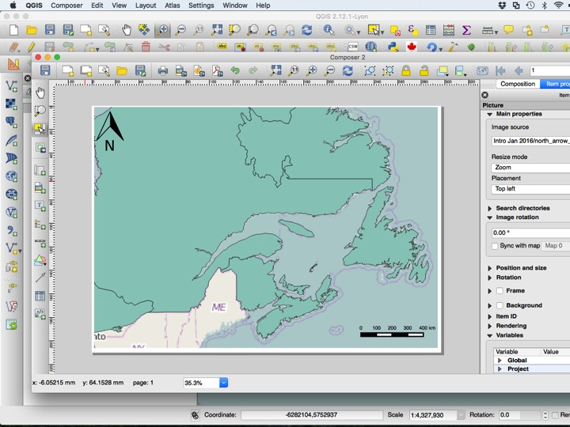

You can export the map using any of the three export buttons provided by QGIS. Save the project and close the composer window.

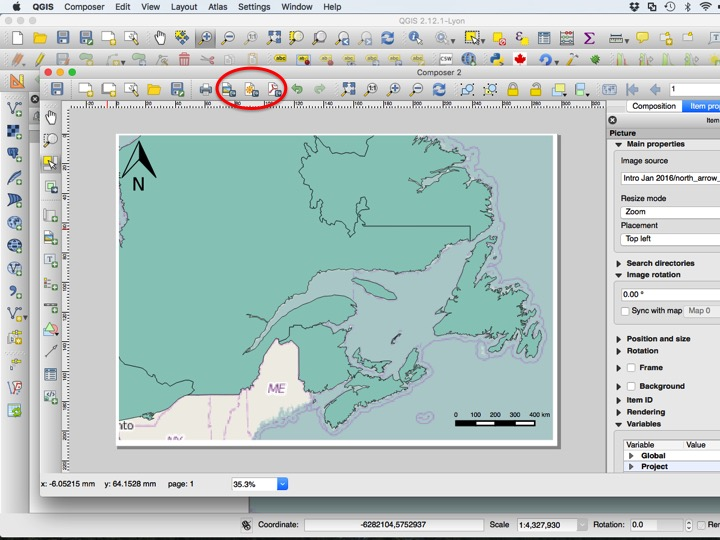

You can retur to either print composer using the *Print Composers* submenu from the *Project* menu.

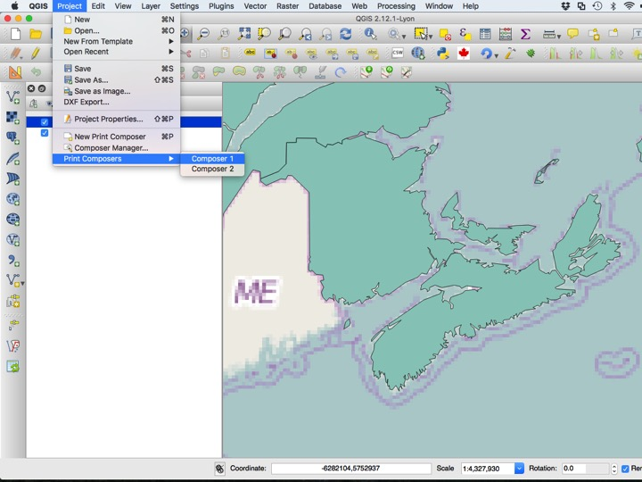

To rename, remove, or duplicate composers, choose *Composer Manager* from the *Project* menu.

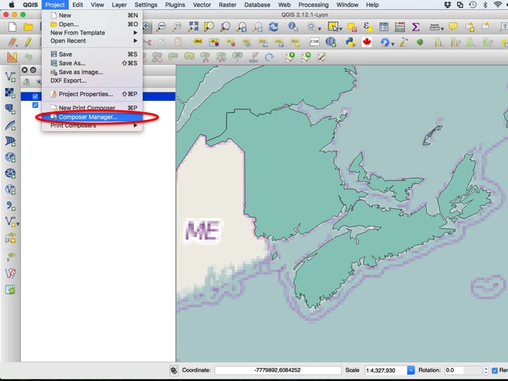

There are several options to choose from, including *Show*, *Duplicate*, *Remove*, and *Rename*.

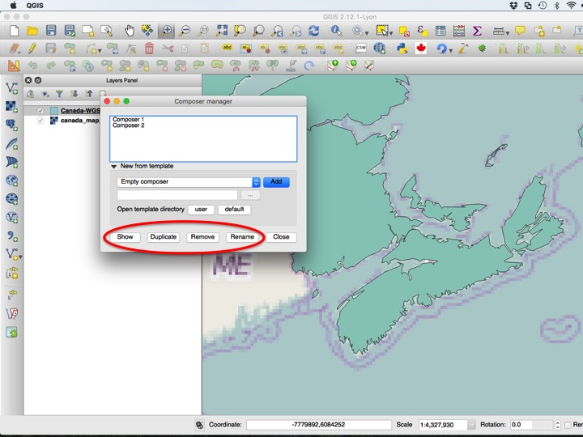

## Assignment Instructions

The assignment submission is a PDF map generated using the print composer from this map. Make sure it includes a scale bar and north arrow. Make sure to save the project when you are done in addition to exporting the map!

## Sequel

So far we have focused on navigating and exporting the map, but not customizing how it looks. In the next module, we will create a [map of Wolfville](05_Map_of_Wolfville.html).

