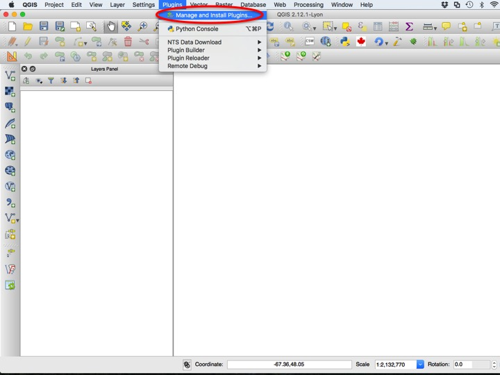
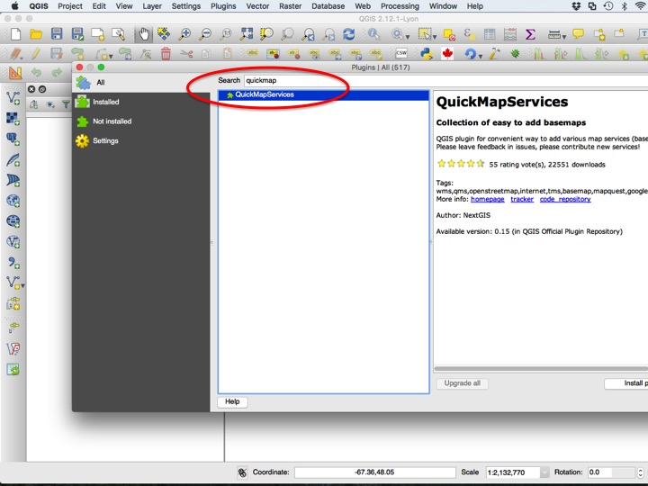
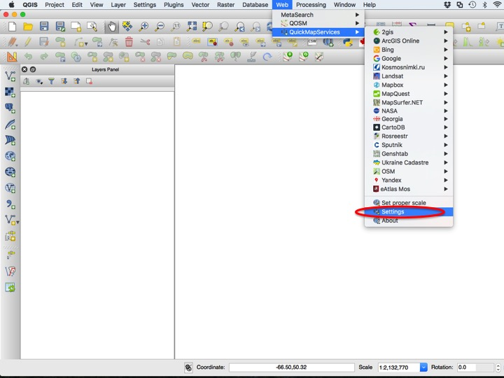
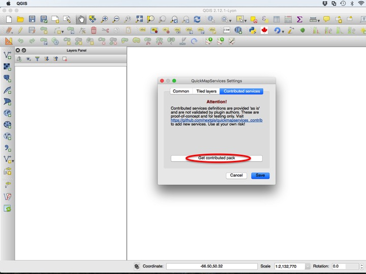
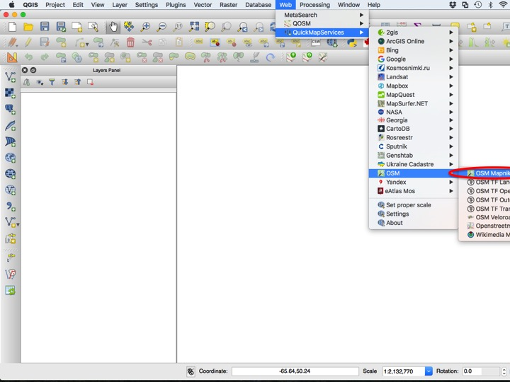
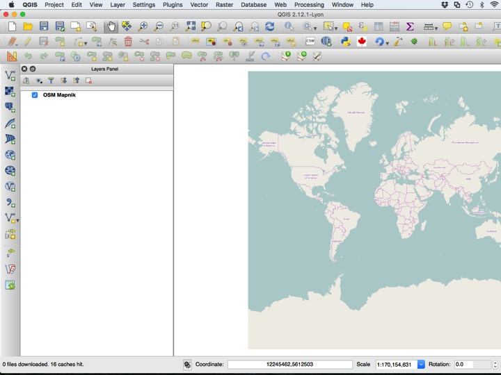
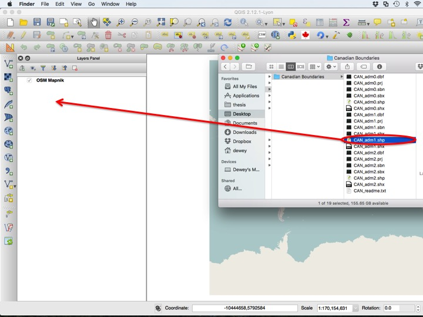
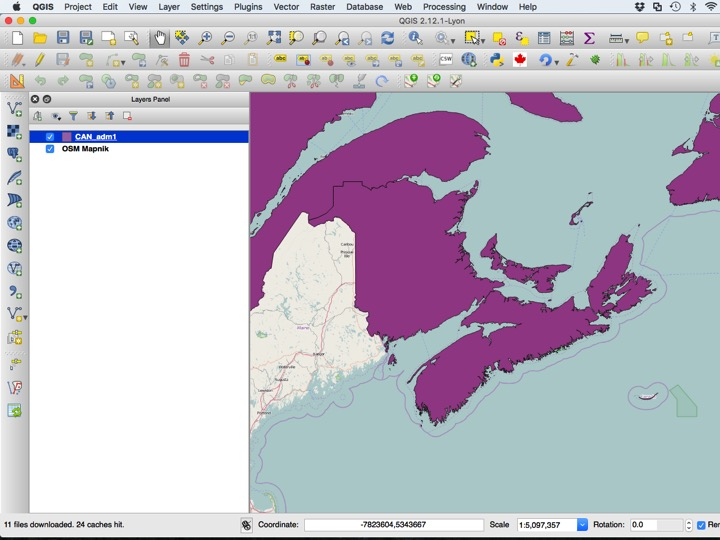
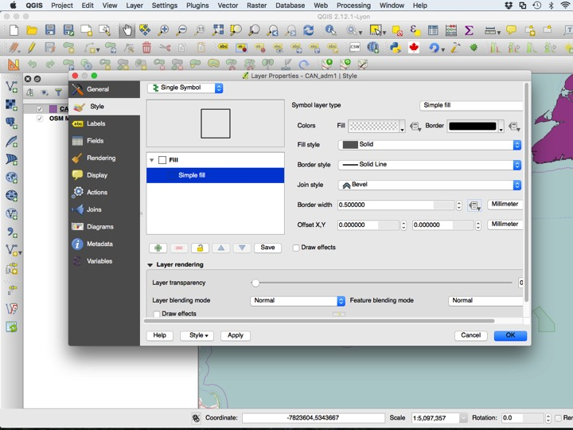

Go back to the [course outline](00_Course_outline.html) or the [Map of Wolfville](05_Map_of_Wolfville.html) tutorial.

## Purpose

* Introduce some online data resources that are freely available
* Demonstrate the use of the Quick Map Services plugin

## Assignment 

There is no assignment for this module.

## Introduction

So far we have used data only from the tutorials folder, which I have nicely manicured so that you can focus on learning specific skills. In the real world, you will want to make a map of your own sample site with your own data. In a later module we will learn how to import your data into QGIS, but you will still need "basemap" data to give spatial context to your data. Below are a few sources of such data.

### GADM: Global Administrative Areas

The [GADM database](http://www.gadm.org/) is a collection of administrative boundaries. You can [download the shapefiles by country](http://www.gadm.org/country) or the [whole world](http://www.gadm.org/version2) if you have a lot of time and a lot of disk space. Several Canadian files are included in this tutorial. These files are for personal or academic use only. Level 0 is countries, level 1 is provices/states, and level 2 is counties.

### The Atlas of Canada

The Atlas of Canada 1:1,000,000 scale dataset is particularly good for Canada-wide maps, as they reflect the zoomed-out nature of these maps and include all of the layers needed to produce a nice-looking map of Canada. You can find a [QGIS Project with most of the layers you will need](https://github.com/paleolimbot/canadamap_template) on GitHub (created by me a long time ago), or you can get the [original data](http://geogratis.gc.ca/api/en/nrcan-rncan/ess-sst/-/(urn:iso:series)atlas-of-canada-national-scale-data-11000000?sort-field=relevance) on GeoGratis.

### CanVec Data

CanVec is the (Canadian) national vector dataset used to create NRCan Topographic Maps (1:50,000 scale). This data is ideal for local-scale maps, such as a map of Wolfville. A county-wide map is probably about as widespread as you will want to go using this dataset, since it is quite detailed and the files can be large. You can get this data from the [GeoGratis Data Extractor](http://geogratis.gc.ca/site/eng/extraction), along with low-resolution digital elevation models.

### GeoGratis

[GeoGratis](http://www.nrcan.gc.ca/earth-sciences/geography/topographic-information/free-data-geogratis/11042) is a multi-purpose geospatial data warehouse for Government of Canada datasets. These datasets are often quite good, although they can be dated (NRCan takes a very serious approach to data validation, which means by the time everything is validated, the maps are ironically out of date).

### GeoNova

The equivalent to GeoGratis in Nova Scotia is GeoNova, which is a general-purpose spatial data warehouse for the province of Nova Scotia. It is somewhat difficult to navigate, but includes some valuable datasets like the Nova Scotia forestry inventory and high-resolution DEM layers. Tiled 1:10,000 topographic information can be found in the [Data Locator](https://gis8.nsgc.gov.ns.ca/esrimap/esrimap.dll?name=DataLocator&cmd=0&t=5330999&b=4728598&l=169676&r=915634&nt=0&nb=0&nl=0&nr=0&action=overview&X=0&Y=0&ind=0&objid=0&DIon=True&NDIon=False&PIon=False&la=&hPid=0&pb=&sz=1&ind=25&searchType=pn&sI=&st=pn&County=&zR=2&il=25). The [Geospatial Data Directory](https://nsgi.novascotia.ca/gdd/) lets you download these these layers province-wide in high resolution, which will take a lot of your time and disk space. It's probably better to stick with the tiled datasets unless you have grand plans to create a province-wide atlas. Note that some ZIP archives put out by GeoNova require something called "P7ZIP" if you are running Mac OS.

### Nova Scotia DNR Data

The Nova Scotia Department of Natural Resources has some excellent data that is often published alongside its paper maps and written publications. They have an excellent [GIS Data](https://novascotia.ca/natr/meb/download/gis-data.asp) section on their website.

## Tutorial

This tutorial will introduce you to another online resource: tiled maps. These are often not great for publishing maps, but can be very helpful when exploring data, and trying to make sure all data align. These services also occasionally provide satellite imagery.

### Installing the QMS Plugin

This functionality depends on the [Quick Map Services plugin](http://nextgis.com/blog/quickmapservices/), which we will have to install from the QGIS Plugins repository. To install the plugin, choose *Manage and Install Plugins...* from the *Plugins* menu.

Next type "quickmap" into the *Search* box, and click *Install plugin* to install. Close the Plugins dialog.

You may wish to add the full spectrum of tiled map sources, which you can do by opening the *Settings* dialog in the *QuickMapServices* menu.

Chose the *Contributed services* tab, then click *Get contributed pack*.

### Adding a QMS Tile Layer

You can add any map service you would like, but we will add the *OSM Mapnik* style. Choose the service you would like to display, and click it to add it as a layer.

You can now zoom in, zoom out, and pan just like you would with a normal map. You can even use these layers in a print composer, although any text will often be too small to be legible in the final product.

### Adding a GADM Layer

Several GADM files are included in your tutorial folder. Add the "CAN_adm1.shp" file to the layers window.

Typically, these boundaries should be displayed with no fill, which you can arrange using the *Layer Properties* dialog.

A typical basemap using GADM looks something like the map below.

## Sequel

Next, we will learn some ways to [import our own data](07_Importing_Data.html) to QGIS. Don't forget to save this project!

