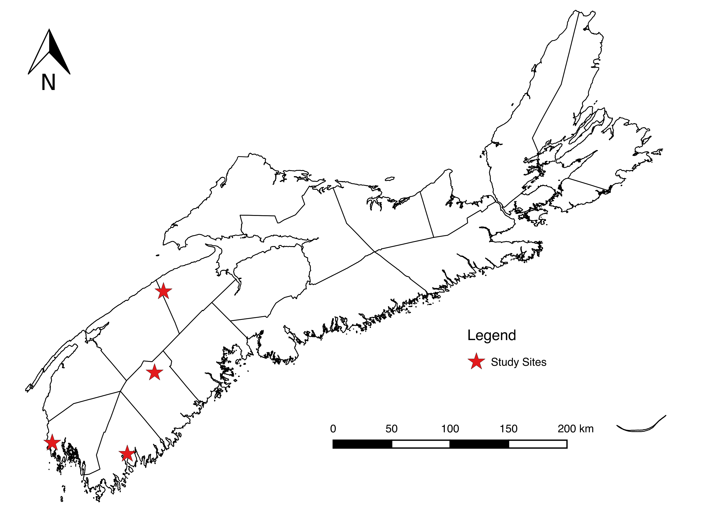
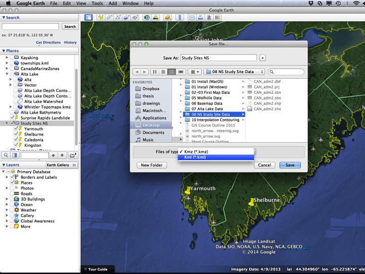
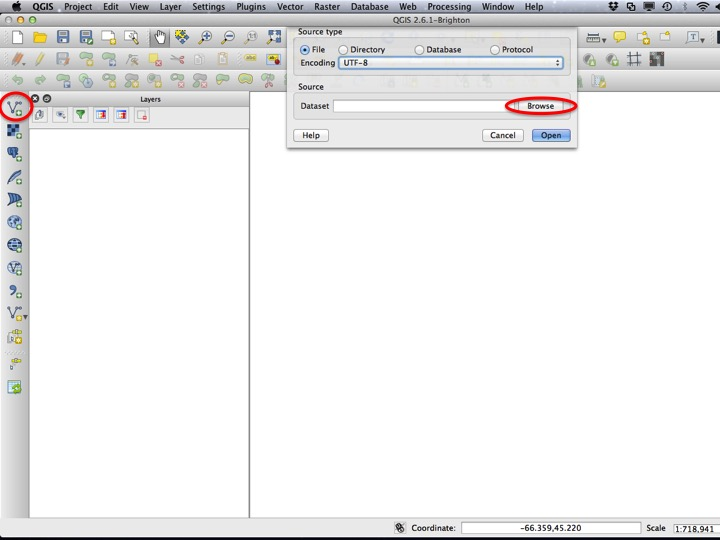
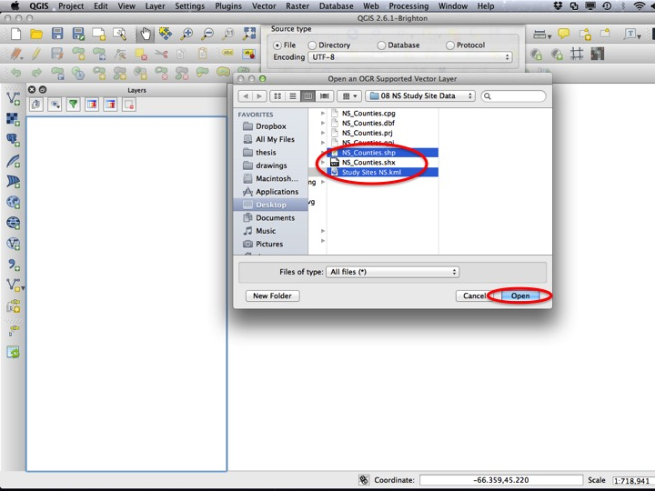
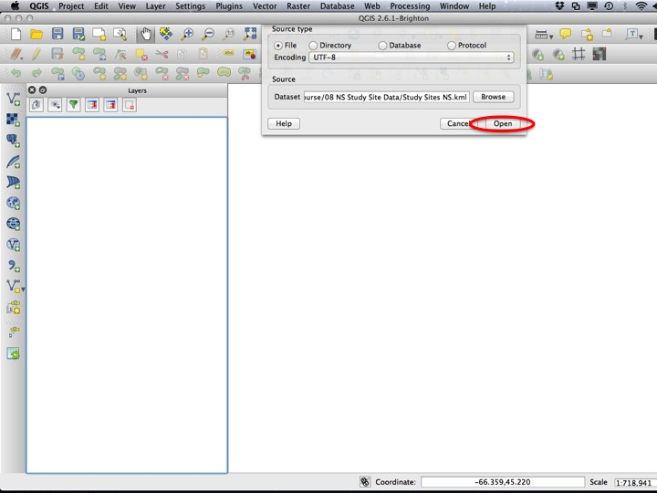
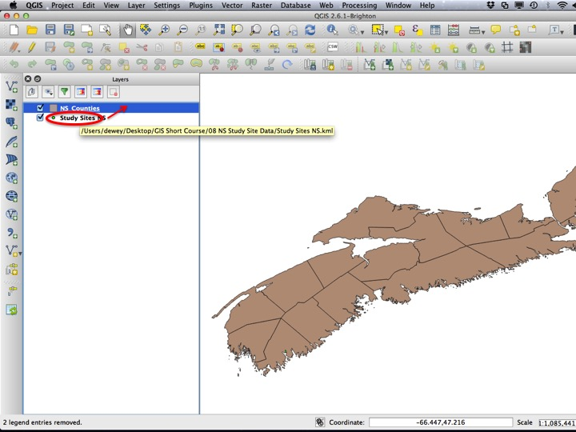
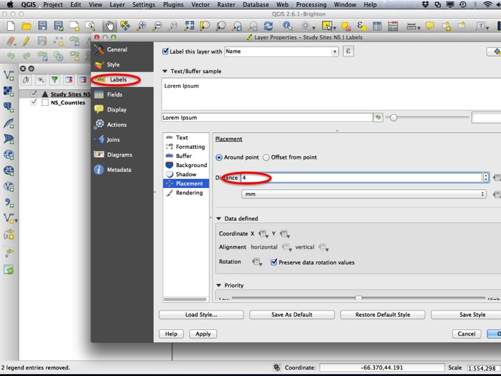
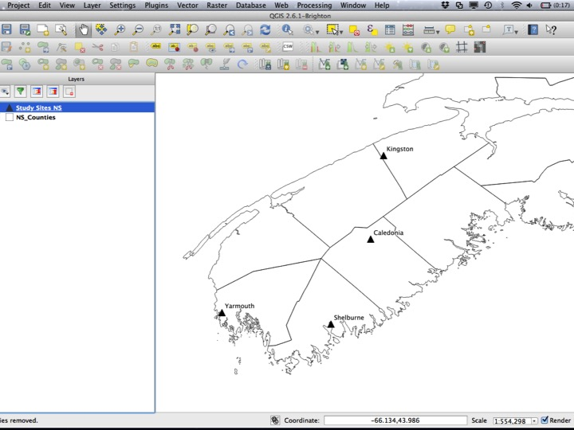
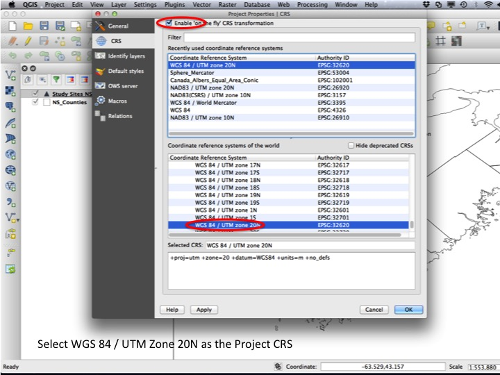
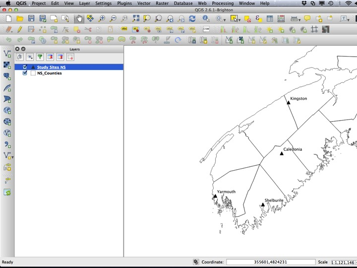

Go back to the [course outline](00_Course_outline.html) or the [importing data](07_Importing_Data.html) tutorial.

## Purpose

* Demonstrate how to export data from Google Earth
* Practice importing Google Earth Data to QGIS
* Practice manipulating layer appearance

## Assignment

The assignment for this module is a PDF map that looks something like the image below.

## Tuorial

This tutorial demonstrates the map-making sequence that we will use in the rest of the course. This process is as follows:

1. Add data
2. Modify the styles (make it look pretty!)
3. Choose a project CRS.
4. Create a Print Composer and export.

### Exporting from Google Earth

You don't need to do this part, but I thought I'd include a screenshot of how to export data from Google Earth. If you need to make a study site map, there's a good chance your data is already in Google Earth. To export it, right click the folder containing your items and choose *Save As...*. You will likely want to save it as a KML rather than a KMZ. QGIS theoretically opens both, but opens KML files more reliably (as do other programs).

### 1. Add the data

We will add two vector layers to create this map. You could drag and drop from the file manager, or you can add them from the *Add Vector Layer* dialog (shown below).

The files you will need to load are the "NS_Counties.shp" layer, and the "Study Sites NS.kml" layer. You can select both by selecting one and presssing the `Ctrl` key while selecting the other (it will be the `Command` key on a mac).

Select *Open* to add the layers.

### 2. Modify the styles

The next step is to modify the appearance of the map. First and foremost, this means making sure all layers are visible. In our case, the Study Sites layer should be above the NS Counties layer. Drag the layer to change the order, and then open the *Layer Properties* dialog for the Study Sites layer.

In addition to choosing the style (I'll leave this up to you), you can add labels for the layer. If you increase the *Distance* around each point, the labels won't intersect with the marker itself.

You should also change the style for the NS Counties layer such that it has only borders and no fill.

### 3. Choose a Project CRS

You should **always remember to set a Project CRS**. In some cases this will be set for you, but for the most part you will have to at least make sure it is not lat/lon (WGS84/EPSG:4326). A good bet for all maps is the World Mercator projection. for Nova Scotia, you can use the UTM zone 20N projection.

After setting the CRS, your map should look like this.

## The Assignment

For your assignment, create a Print Composer and add a scale bar, north arrow, and legend.

## Sequel

So far we have used only data that I have given you. Next, we will enter the realm of [creating and editing features](09_Creating_Editing_Features.html).
