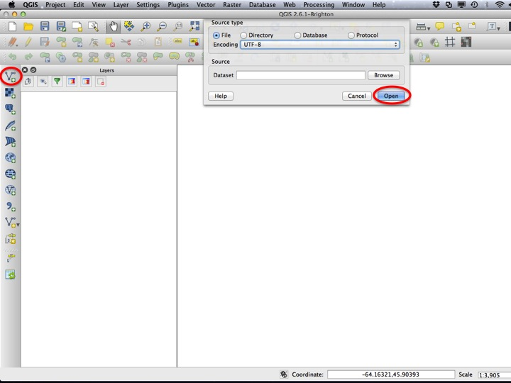
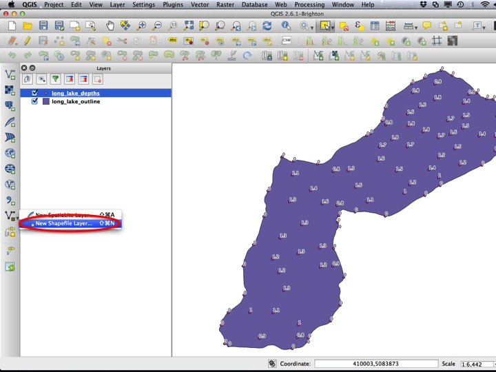
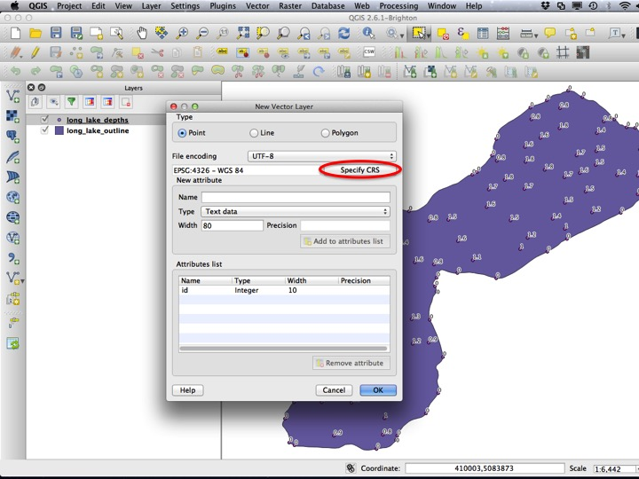
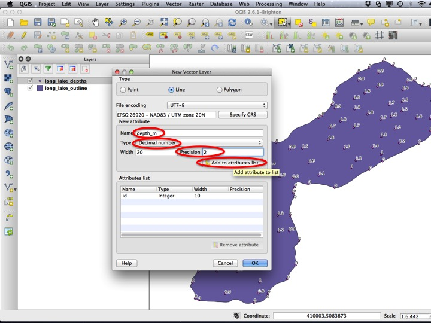
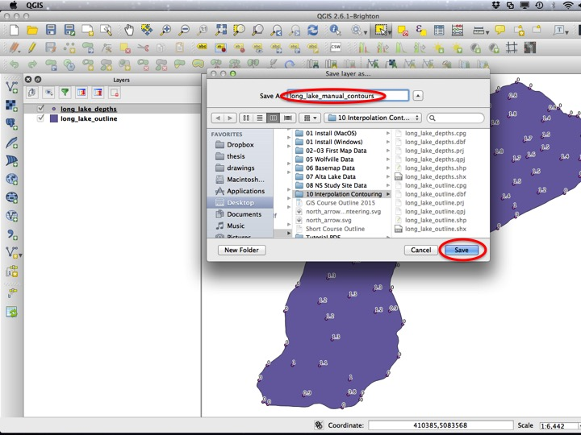
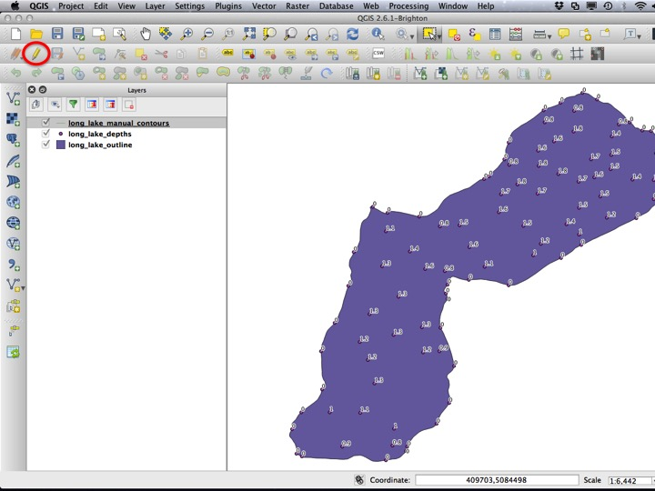
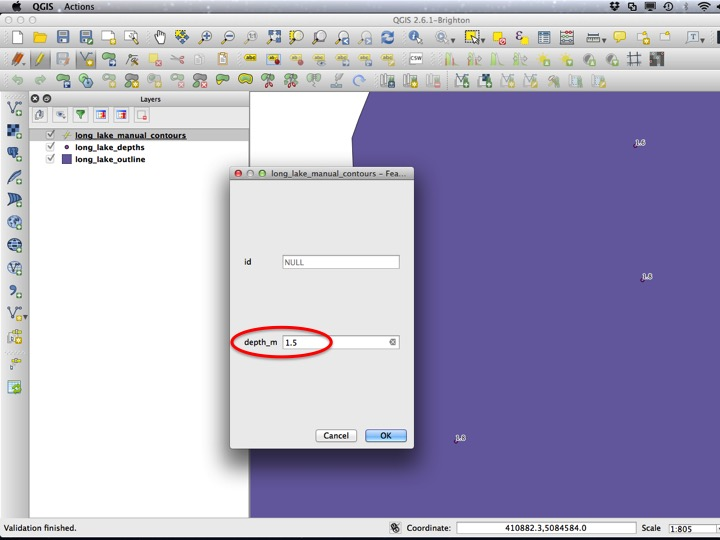
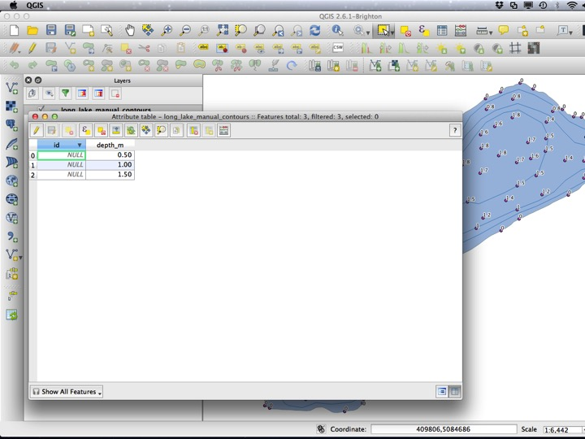

Go back to the [course outline](00_Course_outline.html) or the [study sties map](08_NS_Study_Sites_Map.html) tutorial.

## Purpose

* Learn how to create and edit vector layers
* Learn how to create and modify features

## Assignment

The assignment for this module is a PDF map that looks like the image below.

## Tutorial

First, we will add the data required for the map. Using the *Add Vector Layer* dialog open the *Browse* file chooser.

Open the *long_lake_depths* and *long_lake_outline* layers from the "10 Interpolation Contouring" folder.

We will also add basic labels to each point, which we will need later. You can do this in the *Layer Properties* dialog; the points should be labeled with the "depth_m" field and have a text buffer of 1 mm. While you're at it, you should make the water look like water as well.

### Creating a Vector Layer

Once you have the labels sorted, we can add a new vector layer. From the *New Layer* menu (you'll have to click the little arrow), choose *New Shapefile Layer*.

This will bring up a dialog where we can specify the options for creating the layer. The first choice we have to make is that of the Layer CRS. This should usually be your project CRS, which in our case is UTM Zone 20.

After selecting UTM Zone 20 as the Layer CRS, we need to choose if the new layer will be a *point*, *line*, or *polygon*. We will be creating contours, which are *line* features.

Each depth contour will contain an attribute with the depth that it represents. To store this information in the shapefile, we need to add a field to the *Attributes list*. The field should be called "depth_m", be of *Type* *Decimal number*, and have a *Precision* of 2. This means 2 points after the decimal place. Remember to click *Add to attributes list*!

Finally, when you've made sure you have all the correct options (CRS, point, line, or polygon, and attributes), press *OK*.

QGIS will then prompt you to save he layer. Save the file in the same folder as the data, and call it something like "long lake manual contours". Click *Save*.

### Adding and Editing Features

To change the data that underlies a layer, we need to *Edit* that layer. To do this, you can click the little pencil icon on the *Editing* toolbar. Whenever you are editing a layer, the changes made to that layer are not saved until you turn editing off (by clicking the pencil icon again when that layer is selected, or by right clicking the layer and selecting *Togle Editing*). You should only ever be editing one layer at a time, and be careful when you do. Remember that if you change the data that underlies layer it will change in every project that uses that file, not just the one you are in!

To add a feature, choose the *Add Feature* tool. Click on the map to create your feature. **Don't toggle editing or switch tools while creating your feature!**. It is not saved until you complete it, and your map will look confusing if you try to toggle editing or change tools while you do this. You can use the arrow keys to move the map extent while you are creating.

To finish adding, click on your final point, then right click somewhere else.

You will get a chance to enter your attribute values after you finish adding the feature.

When you have finished adding all of your contour lines (there should be 3...one for 1.5 m, one for 1.0 m, and one for 0.5 m), you will want to save your edits by toggling the editing status or clicking the little save icon next to the pencil.

If we open the **attribute table** for the layer, we should see the attributes we entered when creating the features.

### Changing features

Once features are created, they can be modified (actually, any feature can be modified as long as it comes from a shapefile layer and you've turned editing on for the layer). We will do this for our contours using the *Node tool*. Using this tool, you can click on a feature to look at the nodes, double click the feature to add a node at that location, drag the nodes around, and delete nodes (the one you're about to delete will be blue).

### Deleting features

You can also delete features you're not happy about. You can do this using the *Select* tool, and then clicking *Delete Feature* (in new versions of QGIS this is a red trash can).

## The Assignment

The assignment for this module is a PDF map that looks like the image below. You will need to create a Print Composer, add a scale bar, add a legend, and add a north arrow. You will also need to add labels to your contours.

## Sequel

Next, we will get a brief introduction to processing in QGIS using the [Processing Toolbox](10_Interpolation_Contouring.html). Remember to save your project! You can use the same project for the next module if you would like.
