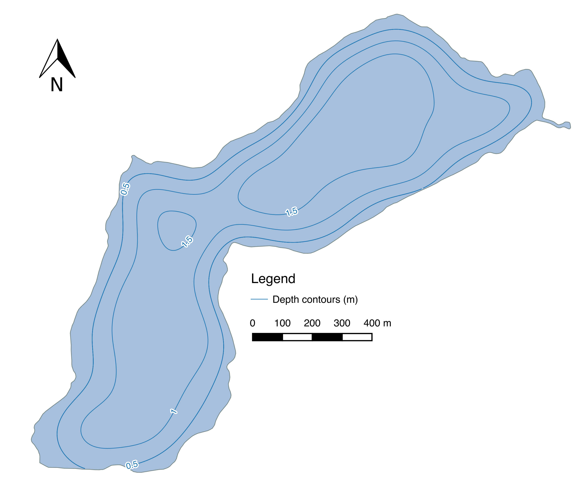

Go back to the [course outline](00_Course_outline.html) or the [creating and editing data](09_Creating_Editing_Features.html) tutorial.

## Purpose

* Learn how to use the *Processing Toolbox* to maniuplate vector and raster data.

## The Assignment

The assignment for this module is very similar to the assignment to your last module, but instead of the manual contours, use the automatically generated contours you will create in this tutorial.

## Tutorial

**Important note about using the processing toolbox**: Some algorithms are sensitive to column names (particularly those in the GRASS toolbox). Words you are not allowed to have in your columns (upper case or lower case) can be found at [this link](https://sqlite.org/lang_keywords.html). The most problematic of these is `AS` (as in, arsenic could be a column name). Spaces in your column names will also not go over well.

First, we will add the data required for the map. Using the *Add Vector Layer* dialog open the *Browse* file chooser.

Open the *long_lake_depths* and *long_lake_outline* layers from the "10 Interpolation Contouring" folder.

### The Processing Toolbox

You should make the water look like water, and it will help you verify your results later if you label your points. To open the *Processing Toolbox*, choose *Toolbox* from the *Processing* menu.

This should open a panel that has a list of processing algorithms. If you don't see "GRASS" in the list, tell the instructor! You will need to install the "GRASS" plugin using the *Plugin Manager*.

### Interpolation

We will run one of these "geoalgorithms" to interpolate between the points to create a **surface** or **raster layer** that represents the same information. The algorithm we will use is called "v.surf.rst", and is short for Regularized Spline Tension. Double click the name to bring up the algorithm window.

In the algorithm window, choose the *Input points layer* as "long_lake_depths".

Next, we have to pick the attribute column that contains our "known" depth values. This is "depth_m".

The other option we have to pick is the output cell size. Rasters are a collection of cells, and if this number is too small the file size will be huge, or if it is too big then the raster won't have enough resolution to describe the surface. For now, set this value to 5 (metres). Click *Run* to run the algorithm.

With any luck, you should see a bunch of layers pop up on your screen. Then one you are interested in is the one labeled "Surface". Remove the other layers.

Let's inspect this raster using the *Identify* tool. Click near the labeled points to see if the raster approximated the known points correctly.

In our case, we want to clip this surface to the edge of the lake, since it doesn't apply outside the lake. We can do this using another algorithm called "Clip grid wih polygon".

The *Input* layer is "Surface", and the *Polygons* layer is "long_lake_outline". Choose *Run* to run the algorithm.

It may try to tell you that the layers do not have the same CRS. In our case this isn't true, but if you get this message in real life and get unexpected results, you should make sure the layers have the same CRS before trying again.

The output should be a raster layer that only has values inside the lake boundary. Remove the "Surface" layer.

### Contouring

There is another geoalgorithm that will draw contour lines based on a raster surface. This algorithm is called "r.contour.step".

Our *Input raster* is the "Output" layer, the minimum contour level is 0.5, the maximum is 2, and the interval is 0.5 m.

When the algorithm is run, you should have a layer called "contours". If you did your hand contouring well, the computer generated contours should look similar to your own.

### Saving the files

So far, your files haven't been saved! They are temporary files, which is great for trying a bunch of things, but not great if you close your project and forge to save them. **Always save the outputs of your processing algorithms** once you've decided to keep them. We will start by saving the raster layer "Output".

Choose a location in which to save the raster output.

Save it as something descriptive in the tutorial folder.

Press *OK* to save the raster layer.

Next we will save the "contours" layer. Right click and choose *Save As...*.

I usually save contour layers with the contour interval somewhere in the name of the file.

Remove the temporary layers, and you should have a project that looks like this.

### The Assignment

For this module, use the Print Composer to create a PDF version of the map you have created. You can choose to include the raster layer or not, but if you do, you should include it in the legend. Your map should look something like the image below.

## Sequel

We're almost there! The next step is to bring it all together with [Advanced Vector Analysis](11_Advanced_Vector_Analysis.html).
