Go back to the [course outline](00_Course_outline.html) or the [geoprocessing](10_Interpolation_Contouring.html) tutorial.

## Purpose

* Use the "Join" feature to combine geographic information with census data.
* Use the *Select by expression* and attribute table sorting to examine spatial trends
* Apply a graduated layer style to visualize spatial trends.

## Assignment

The assignment for this module will be a map of population change in the HRM from 2006 to 2011.

## Tutorial

To start off, we need to add some data. The first layer will be the NS Census Tracts layer in the Advanced Vector Data folder.

Next you can optionally add a tile map backdrop to make sure the data is in the right place.

You will also have to set the projection (Remember! Always set the projection!). Set it to the "World Mercator" projection unless you have a reason to otherwise.

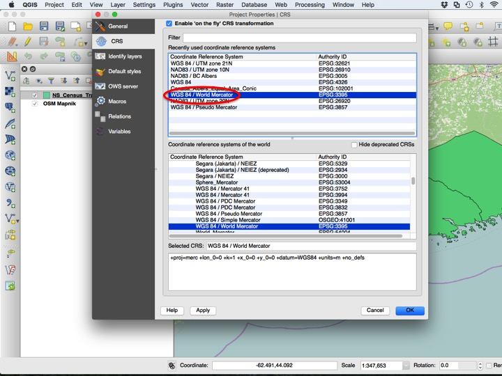

Let's start by examining the attribute table of the layer we've just added.

There isn't any census data! This is because there is so much census data that it couldn't possibly fit in one shapefile layer. Instead, it is kept in a separate table and **joined** to the shapefile using an identifier column.

### Joining Additional Data

To import this data, we will use the **Add Text Delimited Layer** dialog.

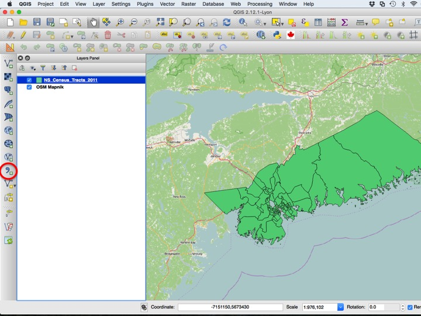

Choose *Browse* to select the file location.

Choose the "ns_2011.csv" file in the "Advanced Vector Data" folder.

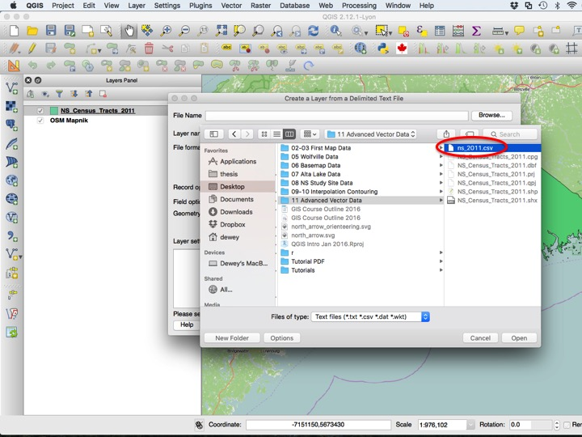

There isn't any geometry in this table (no lat/lon), it's just an attribute table. As such, you'll need to tell QGIS no to assign a gometry.

Now we can see the attribute table in the *Layers* panel. It doesn't have geometry, but we can still view its contents by selecting *Open Attribute Table*.

Lo and behold, we have our data! I've selected a few columns from the large amount of available census data, including 2006-2011 population change, median age, population density, and total population.

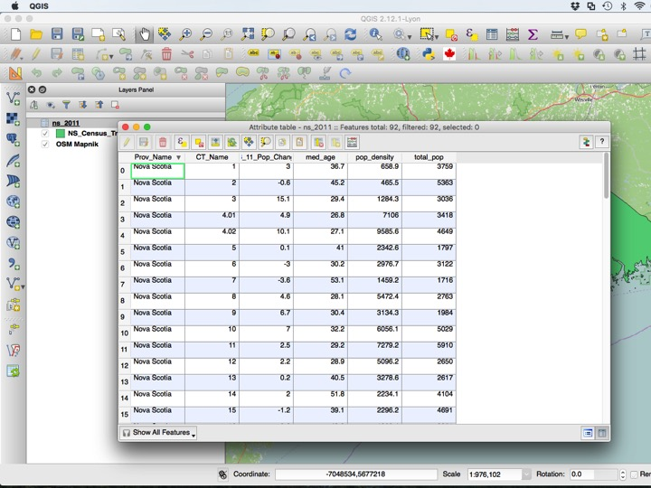

To join this to our spatial data, we need to enter the *Layer Properties* dialog of the spatial layer.

Under the *Joins* tab, select the green "+" symbol.

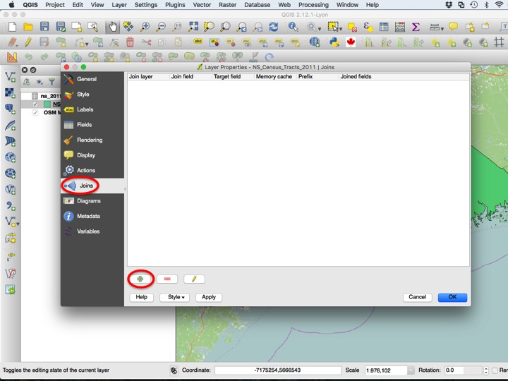

The *Join layer* here is the ns_2011 table, the *Join field* is CT_name, and the *Target field* is CTNAME_NUM. These two columns are the columns that are the "ID" columns for the area that they represent.

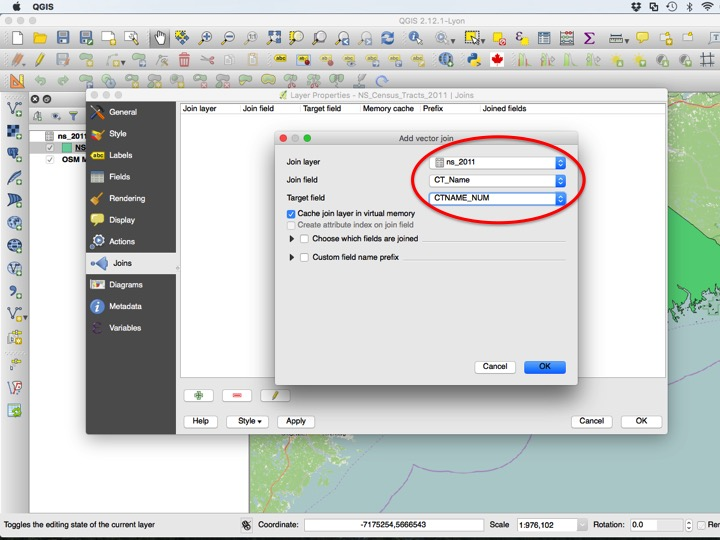

Press *OK* to finalize the join.

Now, open the attribute table of the spatial layer.

You should see that the columns from the table have magically appeared under the spatial layer!

### Attribute Table Sorting

A simple way of spatial analysis is to sort the attribute table. Select a feature by clicking on the row number at the left. Which area has the highest population loss since 2006?

### Select By Expression

Attribute table sorting is good if there aren't many features or if you are only interested in extremes, but a more general-purpose tool is the *Select By Expressio...* dialog. You can find it under the *View* and *Select* menus.

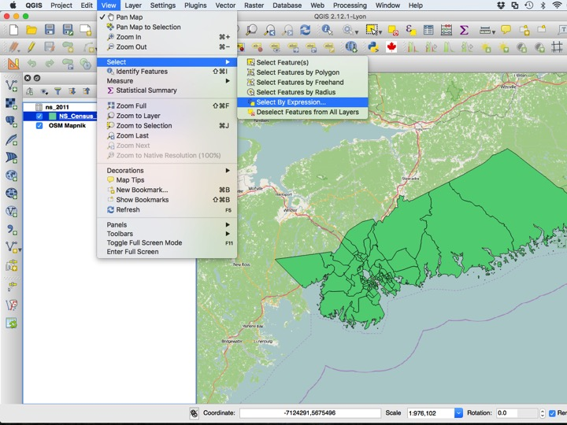

The dialog that pops up is the *Expression editor*, which we have seen briefly before. Which census tracts are gaining population? Use the appropriate column and test `> 0`, and choose *Select* to find out.

To clear the selection, hit the clear selection button.

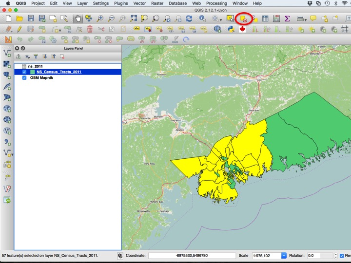

### Graduated Style

A way to visually look at high and low values of an attribute is to change the style according to the value of an attribute. To do this, open the *Layer Properties* dialog.

Next, choose a *Graduated* style.

Choose the population change column, and click *Classify*.

Press *OK*.

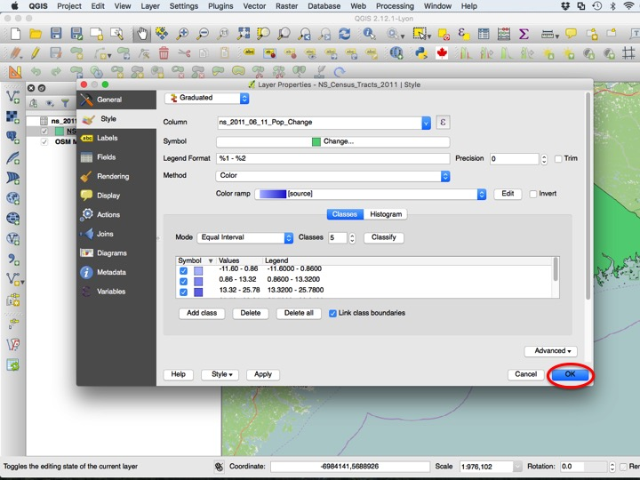

The polygons are now filled according to their population change values, but blue is not the best choice of colour scheme. Return to *Layer Properties*.

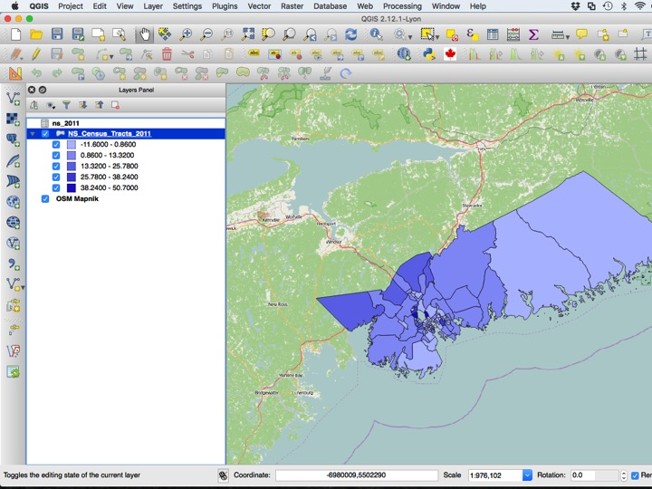

Among other things about the graduated style that we can change is the colour ramp. A good one for our puroses might be RdYGn, since red might naturally mean population loss, and green might naturally mean population gain.

Press *OK* to view the new colour scheme.

Most polygons are loosing population, so not all orange and red polygons represent places where people are moving out of. To fix this, we will revisit the *Layer Properties* dialog.

You can manually change the cut points between th classes, or you can use the *Histogram* to do it visually. Click the *Histogram* tab, then *Load values*.

Drag the vertical bars to adjust the cut points.

A good representation of the HRM would look something like this.

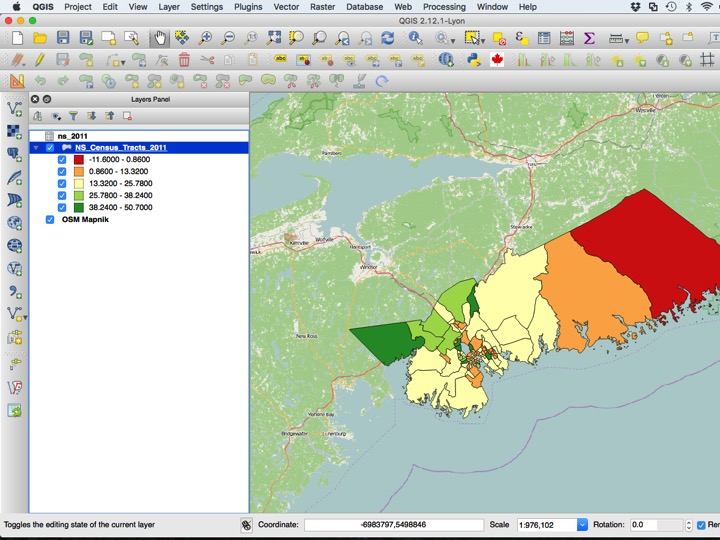

## The Assignment

The assignment for this module will be a map of population change in the HRM from 2006 to 2011. It should include some kind of basemap, a scalebar, and a legend.

## Sequel

The next module is a short module on [where to get QGIS help](12_QGIS_Help.html) on the internet.
