# Making the map look pretty: A Map of Wolfville

The Assignment

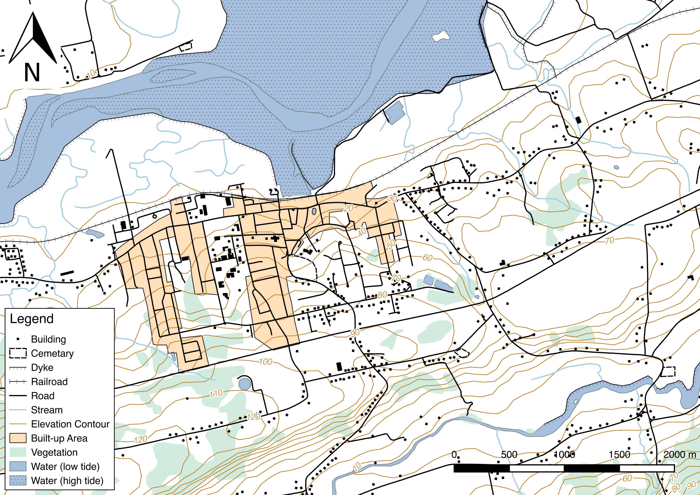

Fish

Fish

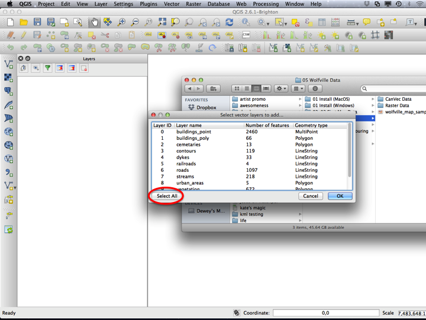

Fish

Fish

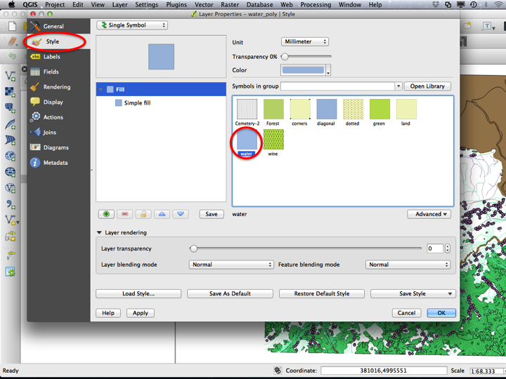

Fish

Fish

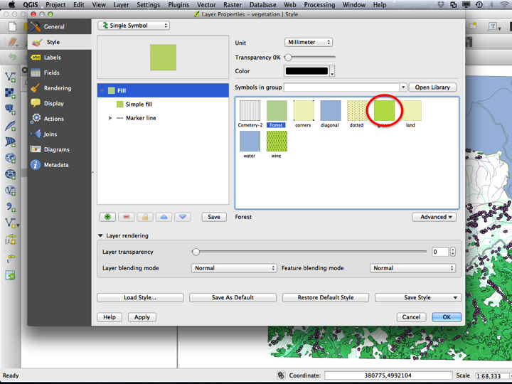

Fish

Fish

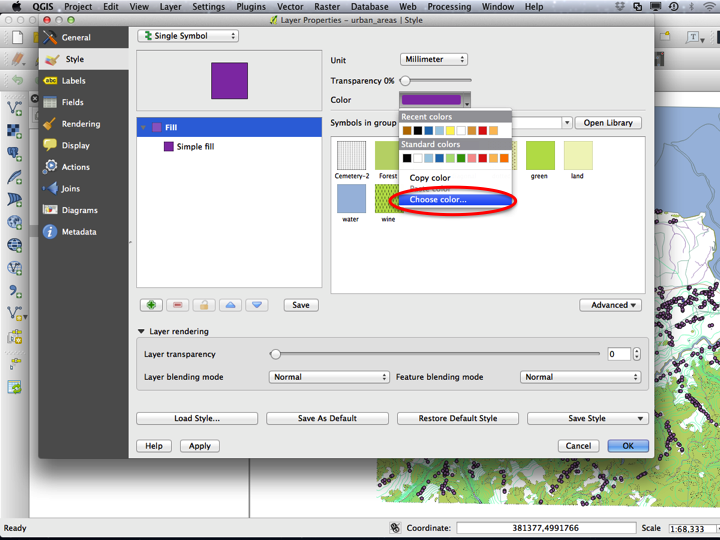

Fish

Fish

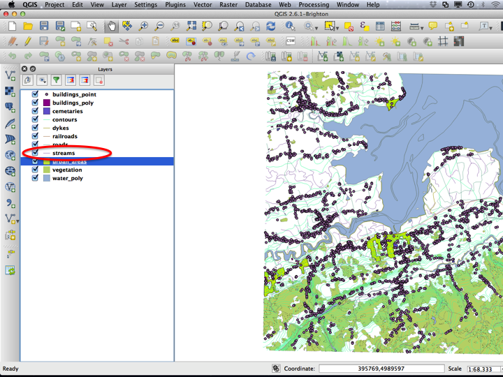

Fish

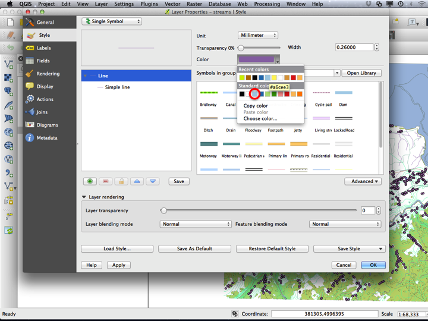

Fish

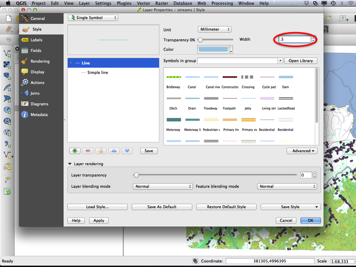

Fish

Fish

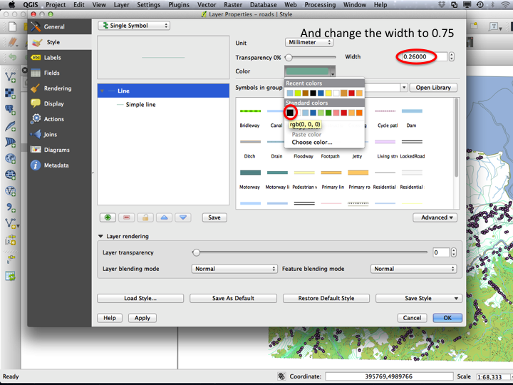

Fish

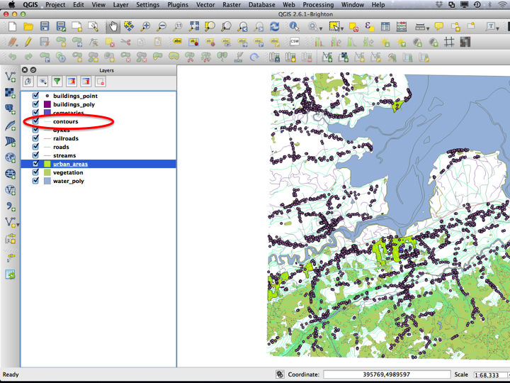

Fish

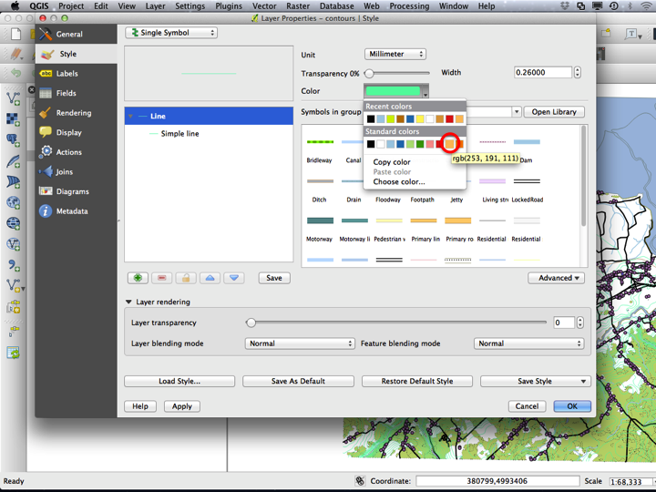

Fish

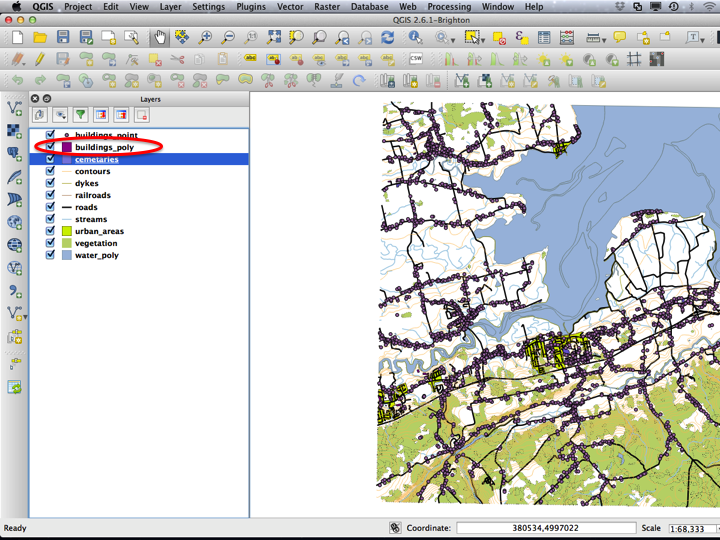

Fish

Fish

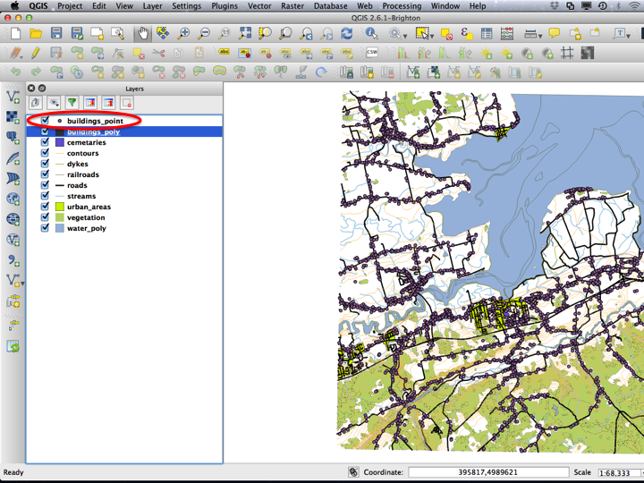

Fish

Fish

Fish